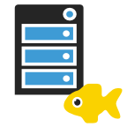

# BlueSkyFish Express Context

> A small library for express micro services summarize the request and response.

Helpful classes and functions for create a express micro service.

**Breaking Change** switch to [yarn][yarn].


## Requirements

* [NodeJS][nodejs] Version 8.x or higher.
* [Yarn][yarn]
* [Typescript][typescript] Version 2.6.2 or higher.
* [Express][express] Version 4.16 or higher

Global installed typescript. `npm install --global typescript`.

The library is written in [Typescript][typescript]. During the installation of the library it will be compiled into Javascript **ES2015** modules.


## Installation


```bash
$ npm install -S blueskyfish-express-context
```

## Dependencies

All libraries from **blueskyfish-express-*** and depended applications should use the same version of the dependencies node modules.

| name                    | Version
|-------------------------|-------------
| `express`               | `4.16.3`
| `lodash`                | `4.17.10`
| `moment`                | `2.22.1`
| `mysql`                 | `2.15.0`
|-------------------------|-------------
| `mocha`                 | `5.1.1`
| `ts-node`               | `6.0.3`
| `typescript`            | `2.8.3`

## Usage

```typescript
// File: action.get-about.ts
import { ActionFunc, IContext } from 'blueskyfish-express-context';

export const name: string = '[about] get about';
export const action: ActionFunc<IContext> = (ctx: IContext) => {
	ctx.sendData({
		version: '1.0.0',
		name: 'Demo',
		title: 'Demo Application'
	});
};

// File: about.module.ts
import * as fromGetAbout from './action.get-about.ts';

export const AboutNames = {
	GET_ABOUT: fromGetAbout.name,
};

export class AboutModule {
	
	static forApp(): IActionPool {
		return new BaseActionPool()
			.addAction(fromGetAbout.name, fromGetAbout.action);
	}
}

// File: app.ts
import * as express from 'express';
import { Log } from 'blueskyfish-express-commons';
import { AboutNames, AboutModule } from './about.module';

const APP_TAG: string = 'demo';
const app: express.Application = express();
const actions: ActionRepository = new ActionRepository()
	.addPool(AboutModule.forApp());

app.get('/about', toRouteHandler(actions, AboutNames.GET_ABOUT));

const server: Http = app.listen(3003, 'localhost', () => {
	Log.info(APP_TAG, 'Demo server is listen @ http://localhost:3003');
});

Env.addShutdown((signal: string) => {
	Log.info(APP_TAG, 'Signal "%s" is receive for shutdown...', signal);
	server.close(() => {
		Log.info(APP_TAG, 'Demo server is stopped');
		Env.exit(0);
	});
});
```


## History

| Version    | Date       | Description
|------------|:----------:|--------------------------------------------
| `0.3.6`    | 2018-05-12 | send stream.
| `0.3.4`    | 2018-05-11 | read and write headers and update libraries. send http status code.
| `0.3.2`    | 2018-05-10 | update libraries and remove deprecated interfaces.
| `0.3.1`    | 2018-05-02 | adjust tsc options.
| `0.2.1`    | 2018-05-01 | switch to yarn
| `0.1.2`    | 2018-04-21 | improve whitelist pattern.<br>add example in `readme.md`.
| `0.1.1`    | 2018-04-20 | fixed `index.d.ts`
| `0.1.0`    | 2018-04-20 | add action pool and repository.<br>auth middleware with verify rigorous validation.<br>improve js doc.
| `0.0.12`   | 2018-04-13 | adjust the version of the depended node modules.<br>Add render method to the IContext
| `0.0.11`   | 2018-03-20 | Pump version of `blueskyfish-common-mysql`.
| `0.0.10`   | 2018-02-22 | adjust the version of the depended node modules.
| `0.0.9`    | 2018-02-19 | adjust the lodash version and use interface IBaseError
| `0.0.8`    | 2018-02-14 | context send error use interface IBaseError.
| `0.0.7`    | 2018-02-11 | request params with string and number (`reg.params[0]` or `req.params['name']`)
| `0.0.6`    | 2018-01-25 | get express request values from the IContext; Enable to override HttpContext; add protected actionMap property;
| `0.0.2`    | 2018-01-24 | auth middleware
| `0.0.1`    | 2018-01-24 | Initial the library. It is extract from my other internal projects.


## License

```text
The MIT License
Copyright 2018 BlueSkyFish
```

[nodejs]: https://nodejs.org/en/
[typescript]: https://www.typescriptlang.org/
[express]: https://expressjs.com/
[yarn]: https://yarnpkg.com/
